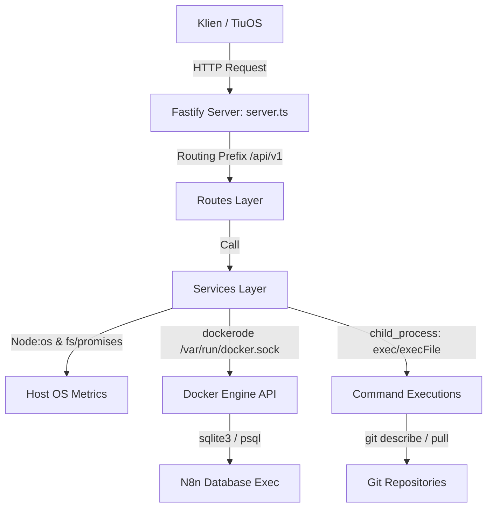

# Dokumentasi Kode Sumber TiuAgent

TiuAgent adalah layanan monitoring real-time berbasis Fastify dan TypeScript yang dirancang untuk berjalan di lingkungan Docker pada Ubuntu Server. TiuAgent bertindak sebagai jembatan informasi untuk mengumpulkan data infrastruktur dari server host (`TiuServer`) dan menyediakannya untuk sistem operasi `TiuOS`.

Dokumentasi ini menjelaskan arsitektur internal, struktur direktori, mekanisme pengumpulan data dari setiap modul layanan (services), serta konfigurasi dan cara kerjanya.

---

## Daftar Isi
1. [Arsitektur Umum](#1-arsitektur-umum)
2. [Struktur Direktori](#2-struktur-direktori)
3. [Aliran Kerja & Penanganan Error](#3-aliran-kerja--penanganan-error)
4. [Detail Modul & Layanan (Services)](#4-detail-modul--layanan-services)
   - [System Service](#system-service)
   - [Storage Service](#storage-service)
   - [Docker Service](#docker-service)
   - [Apps Service](#apps-service)
   - [HanFin Service](#hanfin-service)
   - [Automation Service (n8n)](#automation-service-n8n)
   - [Cloudflare Service](#cloudflare-service)
   - [Backups Service](#backups-service)
   - [Activity Service](#activity-service)
   - [Infrastructure Service](#infrastructure-service)
5. [Konfigurasi Variabel Lingkungan (.env)](#5-konfigurasi-variabel-lingkungan-env)
6. [Instalasi & Deployment](#6-instalasi--deployment)

---

## 1. Arsitektur Umum

TiuAgent menggunakan pola arsitektur **Controller-Service** yang ringan:
* **Server & Routing Layer (Fastify):** Menerima permintaan HTTP, melakukan penanganan CORS, mengelola routing URL dengan prefix `/api/v1`, dan menangani error secara global.
* **Service Layer (TypeScript):** Berisi logika bisnis utama untuk mengumpulkan data. Modul-modul ini mengakses sistem operasi host (menggunakan modul bawaan Node.js seperti `os` dan `fs`), menjalankan command shell, atau berkomunikasi dengan Docker Engine API melalui library `dockerode`.
* **Type Layer:** Mendefinisikan struktur data kontraktual (interface) untuk memastikan konsistensi response API.



---

## 2. Struktur Direktori

Berikut adalah struktur file utama di dalam folder `src/`:

```text
src/
├── plugins/
│   └── cors.ts                 # Konfigurasi CORS Fastify
├── routes/                     # Definisi endpoint HTTP
│   ├── activity.ts
│   ├── apps.ts
│   ├── automation.ts
│   ├── backups.ts
│   ├── cloudflare.ts
│   ├── docker.ts
│   ├── hanfin.ts
│   ├── health.ts
│   ├── infrastructure.ts
│   ├── root.ts
│   ├── storage.ts
│   ├── system.ts
│   └── version.ts
├── services/                   # Logika bisnis & pengumpulan metrik
│   ├── activity.service.ts
│   ├── apps.service.ts
│   ├── automation.service.ts
│   ├── backups.service.ts
│   ├── cloudflare.service.ts
│   ├── docker.service.ts
│   ├── hanfin.service.ts
│   ├── infrastructure.service.ts
│   ├── storage.service.ts
│   └── system.service.ts
├── types/                      # Interface TypeScript untuk input/output
│   ├── activity.types.ts
│   ├── apps.types.ts
│   ├── ... (tipe data per modul)
│   └── system.types.ts
├── utils/                      # Folder utilitas (opsional/cadangan)
└── server.ts                   # Entrypoint aplikasi (inisialisasi server)
```

---

## 3. Aliran Kerja & Penanganan Error

### Inisialisasi Server (`src/server.ts`)
1. Membaca konfigurasi host dan port dari `.env` (default: `0.0.0.0:8080`).
2. Mendaftarkan handler CORS.
3. Mendaftarkan semua route ke instansi Fastify.
4. Menerapkan mekanisme **Graceful Shutdown**: mendengarkan sinyal `SIGINT` dan `SIGTERM` untuk menutup koneksi Fastify secara aman sebelum mematikan proses Node.js.

### Penanganan Error Global
* Jika rute tidak ditemukan, Fastify mengembalikan response `404 Not Found`.
* Jika terjadi error runtime di level service, error akan ditangkap oleh `setErrorHandler`. Status HTTP yang dikembalikan disesuaikan (500 untuk error internal server) dengan format response standar:
  ```json
  {
    "status": "unavailable",
    "reason": "runtime_error"
  }
  ```

---

## 4. Detail Modul & Layanan (Services)

Setiap service dirancang modular untuk mengambil data secara efisien, sebagian besar dilengkapi dengan caching untuk menghindari overhead proses yang berlebihan.

### System Service
* **File:** [system.service.ts](file:///c:/Users/tiuam/OneDrive/Documents/03.%20Tiu%20Agent/src/services/system.service.ts)
* **Tanggung Jawab:** Mengumpulkan metrik performa sistem (CPU, memori, disk, throughput jaringan).
* **Cara Kerja:**
  * **CPU Usage:** Mengambil snapshot status CPU (idle vs total ticks) dari modul bawaan `node:os`, melakukan jeda (`sleep`) selama 100 milidetik, lalu mengambil snapshot kedua untuk menghitung persentase beban CPU secara akurat.
  * **Memory:** Menggunakan `totalmem()` dan `freemem()` dari `node:os`.
  * **Disk:** Membaca kapasitas disk root `/` menggunakan fungsi `statfs` dari `node:fs/promises`.
  * **Network Throughput:** Membaca data byte terkirim/diterima langsung dari interface jaringan Linux di `/sys/class/net` (atau path host `/host/sys/class/net` jika di dalam container). Memilih interface fisik aktif (misalnya `eth0` atau `eno1`), lalu membandingkan selisih byte per detik dengan snapshot sebelumnya untuk menghitung kecepatan download/upload dalam satuan Mbps.

### Storage Service
* **File:** [storage.service.ts](file:///c:/Users/tiuam/OneDrive/Documents/03.%20Tiu%20Agent/src/services/storage.service.ts)
* **Tanggung Jawab:** Menganalisis penggunaan ruang penyimpanan berdasarkan kategori dan folder spesifik.
* **Cara Kerja:**
  * Menjalankan perintah utilitas sistem `du -sb` secara asinkron dengan timeout maksimal 5 detik untuk menghitung ukuran folder secara byte.
  * Mendukung pemetaan path dari dalam container ke sistem file host melalui kamus pemetaan `HOST_MOUNT_STORAGE_PATHS` (misalnya memetakan `/opt/apps` ke `/host/opt/apps`).
  * Mengintegrasikan Dockerode untuk mencari semua Volume Docker yang ada di host, menginspeksi titik mount (`Mountpoint`), kemudian menghitung ukuran masing-masing volume di host untuk menyajikan daftar volume terbesar.
  * Menyimpan hasil pemindaian dalam cache selama 60 detik (`CACHE_TTL_SECONDS`).

### Docker Service
* **File:** [docker.service.ts](file:///c:/Users/tiuam/OneDrive/Documents/03.%20Tiu%20Agent/src/services/docker.service.ts)
* **Tanggung Jawab:** Mengawasi kontainer Docker yang berjalan di server.
* **Cara Kerja:**
  * Menghubungkan ke Docker Daemon melalui Unix Socket (`/var/run/docker.sock`).
  * Mengecek akses berkas socket secara presisi (hak baca/tulis) untuk menentukan penyebab kegagalan jika Docker tidak dapat diakses (mengembalikan alasan detail seperti `socket_not_found` atau `permission_denied`).
  * Untuk kontainer yang sedang aktif (`running`), service melakukan query stats satu-kali (`stream: false`) ke Docker Daemon untuk mengambil penggunaan memori serta menghitung persentase CPU kontainer berdasarkan delta penggunaan CPU kontainer dibanding penggunaan CPU sistem.
  * Menyediakan fitur penulisan waktu aktif (`uptime`) yang diformat secara ramah manusia (misal: `5d 12h`).
  * Hasil query kontainer disimpan di memori (cache) selama 30 detik untuk optimasi performa.

### Apps Service
* **File:** [apps.service.ts](file:///c:/Users/tiuam/OneDrive/Documents/03.%20Tiu%20Agent/src/services/apps.service.ts)
* **Tanggung Jawab:** Memetakan daftar container mentah dari Docker menjadi entitas aplikasi yang terdefinisi di sistem TiuOS.
* **Cara Kerja:**
  * Mengonsumsi data dari `docker.service.ts`.
  * Memiliki daftar statis `APP_DEFINITIONS` yang berisi nama aplikasi (seperti HanFin, n8n, PostgreSQL, Portainer, dll), tipe (monitoring, database, dll), serta URL manajemennya.
  * Jika nama kontainer cocok dengan definisi, data dipetakan ke objek aplikasi resmi. Kontainer lain yang tidak terdaftar akan dipetakan sebagai aplikasi `custom`.
  * Mengekstrak tag versi aplikasi dari nama image Docker (misal `n8n:1.24.0` menghasilkan versi `1.24.0`).

### HanFin Service
* **File:** [hanfin.service.ts](file:///c:/Users/tiuam/OneDrive/Documents/03.%20Tiu%20Agent/src/services/hanfin.service.ts)
* **Tanggung Jawab:** Mengelola deployment dan memonitor status aplikasi keuangan internal "HanFin".
* **Cara Kerja:**
  * **Deteksi Versi:** Mencari file `package.json` di repositori lokal HanFin pada path `/opt/apps/hanfin`. Jika gagal, menjalankan perintah Git `git describe --tags --always --dirty` di folder tersebut.
  * **Deteksi Git Metadata:** Membaca metadata `.git/HEAD` secara langsung melalui file stream. Jika file HEAD mengarah ke referensi cabang (`ref: refs/heads/...`), service membaca file referensi tersebut (atau parse `.git/packed-refs` jika telah di-pack oleh git) untuk mendapatkan commit hash terbaru.
  * **Menjalankan Aksi (Actions):** Mendukung endpoint eksekusi untuk melakukan `pull` (mengambil update dari repo git), `restart` (merestart kontainer docker), dan `deploy` (melakukan `git pull` diikuti dengan `docker compose up -d`).

### Automation Service (n8n)
* **File:** [automation.service.ts](file:///c:/Users/tiuam/OneDrive/Documents/03.%20Tiu%20Agent/src/services/automation.service.ts)
* **Tanggung Jawab:** Mengawasi instansi otomasi bisnis (n8n).
* **Cara Kerja:**
  * Mengambil status kontainer n8n.
  * Melakukan inspeksi lingkungan (`Env`) kontainer n8n via Dockerode untuk mendeteksi tipe database yang digunakan (`DB_TYPE`), apakah berupa PostgreSQL (`postgresdb`) atau SQLite (`sqlite`).
  * **Query Data Internal:** Menggunakan fitur `docker exec` untuk menjalankan kueri SQL di dalam container secara langsung tanpa memerlukan koneksi database eksternal:
    * Jika menggunakan SQLite: Mengeksekusi command `sqlite3` pada file database `/home/node/.n8n/database.sqlite`.
    * Jika menggunakan PostgreSQL: Mencari kontainer PostgreSQL di Docker, lalu mengeksekusi `psql` menggunakan variabel lingkungan kredensial yang disaring.
  * Menghitung total data pada tabel `workflow_entity` (jumlah alur kerja) dan `execution_entity` (jumlah riwayat eksekusi).

### Cloudflare Service
* **File:** [cloudflare.service.ts](file:///c:/Users/tiuam/OneDrive/Documents/03.%20Tiu%20Agent/src/services/cloudflare.service.ts)
* **Tanggung Jawab:** Memantau koneksi Cloudflare Tunnel (agar server dapat diakses dari internet secara aman).
* **Cara Kerja:**
  * Mencari apakah terdapat kontainer Docker aktif bernama `cloudflared` atau `cloudflare-tunnel`.
  * Jika tidak berjalan sebagai container Docker, service akan memindai proses host menggunakan perintah `pgrep -x cloudflared` untuk mendeteksi apakah aplikasi berjalan langsung sebagai sistem servis sistem operasi.

### Backups Service
* **File:** [backups.service.ts](file:///c:/Users/tiuam/OneDrive/Documents/03.%20Tiu%20Agent/src/services/backups.service.ts)
* **Tanggung Jawab:** Memverifikasi ketersediaan direktori penyimpanan cadangan data (backups).
* **Cara Kerja:**
  * Memeriksa keberadaan folder cadangan di beberapa jalur standar (seperti `/host/opt/backups`, `/host/backup`, atau `/backup`) menggunakan modul `node:fs/promises`.
  * Mengembalikan status `available` jika setidaknya satu direktori penyimpanan cadangan ditemukan aktif.

### Activity Service
* **File:** [activity.service.ts](file:///c:/Users/tiuam/OneDrive/Documents/03.%20Tiu%20Agent/src/services/activity.service.ts)
* **Tanggung Jawab:** Mengompilasi feed aktivitas terbaru dari seluruh modul sistem.
* **Cara Kerja:**
  * Memanggil data secara paralel dari Docker Service, Cloudflare Service, HanFin Service, Backup Service, dan Infrastructure Service.
  * Memetakan data tersebut menjadi daftar peristiwa (events) log dengan tingkat signifikansi status (`success`, `warning`, `error`) dan mengembalikan 20 aktivitas terbaru.

### Infrastructure Service
* **File:** [infrastructure.service.ts](file:///c:/Users/tiuam/OneDrive/Documents/03.%20Tiu%20Agent/src/services/infrastructure.service.ts)
* **Tanggung Jawab:** Berperan sebagai aggregator utama untuk memberikan ringkasan kesehatan infrastruktur secara cepat dalam satu request HTTP.
* **Cara Kerja:**
  * Memanggil fungsi metrik sistem, gambaran penyimpanan, status docker, dan aplikasi secara asinkron (`Promise.all`).
  * Menyusun ringkasan status server host, utilitas CPU & Memori, rasio penyimpanan, total container berjalan, dan jumlah aplikasi sehat.

---

## 5. Konfigurasi Variabel Lingkungan (.env)

TiuAgent menggunakan beberapa variabel lingkungan untuk menyesuaikan perilakunya di server target:

| Nama Variabel | Nilai Default | Deskripsi |
| --- | --- | --- |
| `NODE_ENV` | `production` | Lingkungan runtime node (misal: `production`, `development`). |
| `HOST` | `0.0.0.0` | IP Address pengikatan (bind) server HTTP Fastify. |
| `PORT` | `8080` | Port TCP untuk lalu lintas HTTP. |
| `LOG_LEVEL` | `info` | Tingkat kejelasan logging Fastify (`info`, `warn`, `error`, `debug`). |
| `SERVER_HOSTNAME` | `tiuserver` | Nama host server yang dikembalikan pada endpoint informasi umum. |
| `STORAGE_PATHS` | `/opt/apps,/opt/infra,/opt/backups,/home` | Daftar folder (dipisahkan koma) yang akan dihitung ukurannya oleh Storage Service. |
| `DOCKER_SOCKET_PATH`| `/var/run/docker.sock` | Jalur Unix Socket milik Docker Engine. |
| `HANFIN_PATH` | `/opt/apps/hanfin` | Folder repositori git lokal untuk aplikasi HanFin. |

---

## 6. Instalasi & Deployment

### Prasyarat
* Node.js versi 22+ (untuk pengembangan lokal)
* Docker dan Docker Compose (untuk deployment server)

### Build & Menjalankan Lokal
1. Pasang dependensi proyek:
   ```bash
   npm install
   ```
2. Lakukan kompilasi TypeScript ke JavaScript:
   ```bash
   npm run build
   ```
3. Jalankan server:
   ```bash
   npm start
   ```

### Deployment Menggunakan Docker (Rekomendasi)
TiuAgent dideploy di server host pada direktori `/opt/infra/tiu-agent`. Konfigurasi docker compose memetakan socket Docker host dan folder-folder sistem agar TiuAgent dapat membaca data metrik host.

```bash
# Buat direktori deployment
sudo mkdir -p /opt/infra/tiu-agent
sudo chown -R "$USER":"$USER" /opt/infra/tiu-agent

# Salin source code ke server, lalu jalankan
docker compose up -d --build
```
